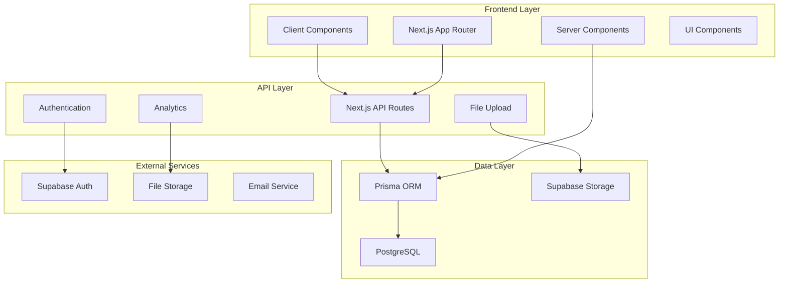
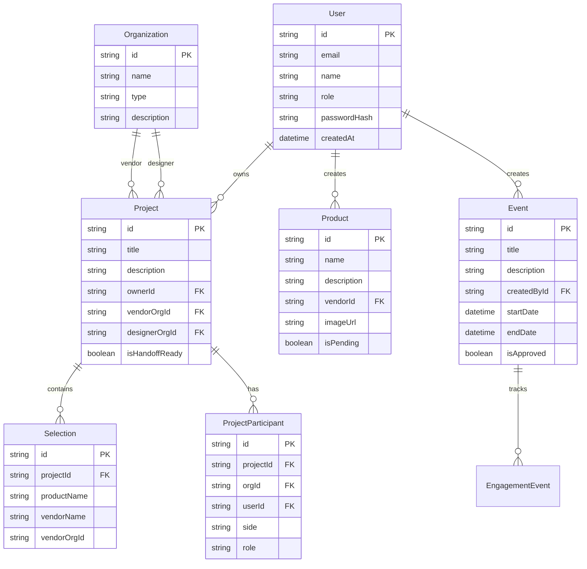

# Folio Cross-Role Functionality & Integration Audit Report

## Executive Summary

This audit examines the Folio codebase for cross-role functionality, integration opportunities, and system architecture. Folio serves three core user types: **Designers**, **Vendors**, and **Admin** in a professional interior design ecosystem focused on inspiration → execution with real products and real designers.

**Key Findings:**
- ✅ Strong foundation with Next.js + Prisma + Supabase architecture
- ⚠️ Missing CAD/3D file upload requirements for products
- ⚠️ Editorial pipeline uses file-based storage instead of database
- ⚠️ Limited cross-role integration opportunities
- ⚠️ Analytics system needs enhancement for vendor insights

---

## 1. System Overview

### Architecture Diagram



### Core Components

**UI Routes/Pages:**
- `/designer/*` - Designer dashboard, projects, portfolio
- `/vendor/*` - Vendor dashboard, products, analytics
- `/admin/*` - Admin panel, editorial review, user management
- `/events/*` - Event management and participation
- `/projects/*` - Project collaboration and handoff

**API Routes:**
- `/api/auth/*` - NextAuth authentication
- `/api/designer/*` - Designer-specific operations
- `/api/vendor/*` - Vendor operations and analytics
- `/api/admin/*` - Admin operations
- `/api/events/*` - Event management
- `/api/analytics/*` - Engagement tracking

**Services:**
- `src/lib/auth.ts` - Authentication configuration
- `src/lib/analytics.ts` - Event tracking
- `src/lib/uploadToSupabase.ts` - File upload handling
- `src/lib/visibility/vendorProjects.ts` - Vendor project visibility

---

## 2. Role Capabilities & Interaction Points

### Designer (Primary Role)

**Current Capabilities:**
- Project creation and management (`src/app/designer/projects/`)
- Product tagging and selection (`src/components/selection/`)
- Event participation (`src/app/events/`)
- Editorial submission (`src/app/api/editorial-submissions/`)
- Portfolio management (`src/app/designer/profile/`)

**Cross-Role Touchpoints:**
- **Vendor → Designer**: Product handoffs via `VendorVisit` and `HandoffPackage`
- **Admin → Designer**: Editorial approval workflow
- **Designer → Vendor**: Product selections and quotes

**Missing Capabilities:**
- CAD/3D file integration for product specifications
- Client lead management
- Affiliate link generation
- Advanced portfolio analytics

### Vendor Role

**Current Capabilities:**
- Product upload and management (`src/app/vendor/create-product/`)
- Analytics dashboard (`src/app/vendor/dashboard/`)
- Event participation (`src/app/vendor/events/`)
- Project handoff creation (`src/app/vendor/create-project/`)
- Quote management (`src/app/api/quotes/`)

**Cross-Role Touchpoints:**
- **Vendor → Designer**: Handoff packages via `HandoffPackage`
- **Vendor → Admin**: Product approval workflow
- **Vendor → Designer**: Product analytics and engagement

**Missing Capabilities:**
- CAD/3D file upload requirements
- Advanced analytics and insights
- Storefront management
- Designer collaboration tools

### Admin Role

**Current Capabilities:**
- Editorial review (`src/app/admin/editorial-review/`)
- Event management (`src/app/admin/events/`)
- User management (`src/app/admin/`)
- Analytics oversight (`src/app/admin/vendor-analytics/`)

**Cross-Role Touchpoints:**
- **Admin → Designer**: Editorial approval
- **Admin → Vendor**: Product approval
- **Admin → All**: Event management and curation

**Missing Capabilities:**
- Automated content moderation
- Advanced user verification
- Policy enforcement tools
- Comprehensive analytics dashboard

---

## 3. Data Model & Access Control Deep-Dive

### Prisma ER Diagram



### Access Control Analysis

**RBAC Implementation:**
- **Role-based**: `User.role` enum (ADMIN, VENDOR, DESIGNER, HOMEOWNER, GUEST)
- **Organization-based**: `OrganizationUser` with `OrgUserRole` (OWNER, ADMIN, MANAGER, MEMBER, VIEWER)
- **Project-level**: `ProjectParticipant` with `ParticipantSide` (DESIGNER, VENDOR) and `ParticipantRole` (OWNER, EDITOR, VIEWER)

**Critical Access Control Issues:**

1. **P0 - Missing Vendor Org Scoping** (`src/app/api/vendor/projects/route.ts:107`)
   ```typescript
   // ISSUE: Only filters by ownerId, ignores vendorOrgId
   where: { ownerId: userId }
   // SHOULD BE: Use vendorProjectsWhere helper
   ```

2. **P0 - Client-Side ID Trust** (`src/components/VendorProjectCreator.tsx:104`)
   ```typescript
   // ISSUE: Trusts client-provided vendorOrgId
   vendorOrgId: vendorOrgId && vendorOrgId.trim() ? vendorOrgId : undefined
   // SHOULD BE: Infer from session via getVendorContext()
   ```

3. **P1 - Missing Authorization Checks** (`src/app/api/events/route.ts`)
   - No role-based access control on event creation
   - Missing organization scoping for event management

**Data Minimization Issues:**
- `EngagementEvent.meta` stores full user agent and referer data
- `User` model contains sensitive fields without encryption
- No data retention policies for analytics events

---

## 4. Auth, Sessions, and Permissions

### NextAuth Configuration Analysis

**Current Setup** (`src/app/api/auth/[...nextauth]/options.ts`):
- ✅ Credentials provider with bcrypt password hashing
- ✅ JWT strategy with role hydration from database
- ✅ Session callbacks properly inject user ID and role
- ✅ Case-insensitive email lookup

**Security Issues:**

1. **P1 - Missing CSRF Protection**
   - No explicit CSRF token validation
   - Relies on NextAuth's built-in protection only

2. **P1 - Session Security**
   - No session timeout configuration
   - Missing secure cookie options for production

3. **P2 - Password Policy**
   - No password strength requirements
   - No password history tracking

### Vendor-Org Scoping Verification

**✅ Properly Implemented:**
- `src/lib/auth/vendorContext.ts` - Server-side vendor context
- `src/lib/visibility/vendorProjects.ts` - Unified visibility predicate
- `src/app/api/vendor/projects/route.ts` - Updated to use vendor context

**⚠️ Needs Review:**
- Event creation permissions
- Product upload authorization
- Analytics data access

---

## 5. File Uploads & Assets (CAD/3D Required)

### Current Upload Implementation

**File Upload Routes:**
- `src/app/api/upload-spec-sheet/route.ts` - Spec sheet uploads (PDF, DOCX, DOC, TXT)
- `src/app/api/videos/upload/route.ts` - Video uploads with transcription
- `src/lib/uploadToSupabase.ts` - Supabase storage integration

**Critical Issues:**

1. **P0 - Missing CAD/3D Requirements**
   ```typescript
   // CURRENT: No CAD/3D file validation
   const allowedTypes = ['application/pdf', 'application/vnd.openxmlformats...']
   
   // REQUIRED: Add CAD/3D file types
   const allowedTypes = [
     'application/pdf',
     'application/vnd.openxmlformats...',
     'application/step', // STEP files
     'application/x-step', // STEP files
     'model/obj', // OBJ files
     'application/x-3ds', // 3DS files
     'application/x-blender', // Blender files
   ]
   ```

2. **P1 - File Size Limits**
   - Current: 10MB limit for spec sheets
   - CAD/3D files typically 50-500MB
   - Need tiered size limits based on file type

3. **P1 - Missing File Validation**
   - No CAD file integrity checks
   - No 3D model validation
   - No preview generation

### Supabase Storage Analysis

**Current Implementation:**
- Basic file upload to Supabase Storage
- No ACL policies defined
- Missing signed URL generation for secure access

**Required Enhancements:**
- CAD/3D file type validation
- File size limits by type
- Preview generation for 3D models
- Secure access controls

---

## 6. Event System & Editorial Pipeline

### Event Flow Analysis

**Current Event System:**
- Event creation (`src/app/api/admin/events/route.ts`)
- RSVP management (`src/app/api/events/[id]/rsvp/route.ts`)
- Engagement tracking (`src/app/api/analytics/track/route.ts`)

**Editorial Pipeline Issues:**

1. **P0 - File-Based Storage** (`src/app/api/editorial-submissions/route.ts`)
   ```typescript
   // ISSUE: Uses file-based storage instead of database
   const editorialQueue = JSON.parse(fs.readFileSync(editorialQueuePath, 'utf8'));
   
   // SHOULD BE: Database-backed editorial queue
   const submissions = await prisma.editorialSubmission.findMany({
     where: { status: 'pending' }
   });
   ```

2. **P1 - Missing Editorial Model**
   - No `EditorialSubmission` model in schema
   - No `Editorial` model for published content
   - No editorial approval workflow in database

### Merit-Based System Verification

**✅ Properly Implemented:**
- Event approval workflow (`Event.isApproved`)
- User reputation scoring (`User.followers`, `User.views`)
- Engagement-based analytics

**⚠️ Needs Enhancement:**
- Editorial ranking algorithm
- Sponsored content labeling
- Merit-based promotion system

---

## 7. Product → Project → Selection Loop (Core UX)

### Current Flow Analysis

**Product Discovery:**
- Events → Product spotlighting
- Editorial content → Product features
- Designer searches → Product selection

**Selection Process:**
- Designer tags products in projects
- Creates selections with vendor attribution
- Generates quotes and specifications

**Critical Gaps:**

1. **P1 - Missing Provenance Tracking**
   ```typescript
   // CURRENT: Basic selection model
   model Selection {
     productName String?
     vendorName String?
     source String @default("upload")
   }
   
   // REQUIRED: Enhanced provenance
   model Selection {
     sourceEventId String?
     sourceEditorialId String?
     sourceVendorId String?
     sourceCampaignId String?
     provenance Json? // Full attribution chain
   }
   ```

2. **P1 - Inconsistent Foreign Keys**
   - `Selection.vendorOrgId` missing
   - No back-reference to source event
   - Missing campaign attribution

3. **P2 - Analytics Gaps**
   - No selection-to-purchase tracking
   - Missing vendor performance metrics
   - No designer preference analysis

---

## 8. Analytics & "Leading Indicators"

### Current Analytics Implementation

**Engagement Tracking:**
- `EngagementEvent` model for user actions
- Event-based analytics (`EventProductStat`)
- Basic vendor analytics (`src/app/api/vendor/analytics/route.ts`)

**Missing Analytics:**

1. **P1 - Real-Time Signals**
   - No live engagement metrics
   - Missing pre-sales indicators
   - No waitlist management

2. **P1 - Vendor Insights**
   - Limited product performance data
   - No designer engagement metrics
   - Missing conversion tracking

3. **P2 - Predictive Analytics**
   - No trend analysis
   - Missing demand forecasting
   - No recommendation engine

### Analytics Pipeline Proposal

```typescript
// Enhanced analytics model
model AnalyticsEvent {
  id String @id @default(uuid())
  userId String
  eventType String // 'product_view', 'selection_created', 'quote_requested'
  entityType String // 'product', 'event', 'editorial'
  entityId String
  metadata Json
  timestamp DateTime @default(now())
  
  // Aggregation fields
  sessionId String?
  campaignId String?
  sourceEventId String?
}

// Real-time aggregation
model AnalyticsAggregate {
  id String @id @default(uuid())
  entityType String
  entityId String
  metric String // 'views', 'saves', 'selections', 'quotes'
  value Int
  period String // 'hour', 'day', 'week'
  timestamp DateTime
}
```

---

## 9. Affiliate/Monetization Surfaces

### Current Implementation

**Affiliate Links:**
- Basic product URLs (`Product.url`)
- No affiliate tracking
- No commission management

**Missing Monetization:**

1. **P1 - Affiliate System**
   - No affiliate link generation
   - Missing commission tracking
   - No payout management

2. **P1 - Sponsorship Management**
   - No sponsored content labeling
   - Missing sponsorship tiers
   - No payment integration

3. **P2 - Revenue Sharing**
   - No designer-vendor revenue sharing
   - Missing platform fees
   - No subscription tiers

### Monetization Integration Proposal

```typescript
// Affiliate system
model AffiliateLink {
  id String @id @default(uuid())
  productId String
  designerId String
  vendorId String
  affiliateCode String @unique
  commissionRate Decimal
  isActive Boolean @default(true)
  createdAt DateTime @default(now())
}

// Sponsorship system
model Sponsorship {
  id String @id @default(uuid())
  eventId String
  vendorId String
  tier String // 'FREE', 'SPONSORED', 'PREMIUM'
  amount Decimal
  benefits Json
  isActive Boolean @default(true)
}
```

---

## 10. Search, Feed, and Curation

### Current Search Implementation

**Search Routes:**
- `src/app/api/products/search/route.ts` - Product search
- `src/app/api/inspire/route.ts` - Inspire feed
- Basic text search without advanced filtering

**Curation Issues:**

1. **P1 - Limited Search Capabilities**
   - No advanced filtering
   - Missing category-based search
   - No vendor-specific search

2. **P1 - Feed Algorithm**
   - No personalized recommendations
   - Missing engagement-based ranking
   - No A/B testing framework

3. **P2 - Content Discovery**
   - Limited editorial integration
   - Missing event-based recommendations
   - No designer preference learning

### Enhanced Search Proposal

```typescript
// Search index model
model SearchIndex {
  id String @id @default(uuid())
  entityType String // 'product', 'event', 'editorial'
  entityId String
  searchableText String
  categories String[]
  tags String[]
  vendorId String?
  designerId String?
  engagementScore Float
  lastUpdated DateTime @default(now())
}

// Feed algorithm
model FeedAlgorithm {
  id String @id @default(uuid())
  userId String
  algorithmType String // 'collaborative', 'content-based', 'hybrid'
  parameters Json
  performance Json
  lastUpdated DateTime @default(now())
}
```

---

## 11. Security & Compliance Checklist

### Security Analysis

**✅ Properly Implemented:**
- Password hashing with bcrypt
- JWT-based authentication
- Role-based access control
- File upload validation

**Critical Security Issues:**

1. **P0 - Missing Input Validation**
   ```typescript
   // ISSUE: No Zod validation on API routes
   const body = await request.json();
   // SHOULD BE: Zod schema validation
   const body = await requestSchema.parse(await request.json());
   ```

2. **P0 - Missing Authorization Checks**
   ```typescript
   // ISSUE: No role verification
   export async function POST(request: NextRequest) {
     // SHOULD BE: Add authorization check
     const session = await getServerSession(authOptions);
     if (!session?.user?.id) {
       return NextResponse.json({ error: "Unauthorized" }, { status: 401 });
     }
   }
   ```

3. **P1 - File Upload Security**
   - No file type validation beyond MIME type
   - Missing virus scanning
   - No file size limits by user role

4. **P1 - Data Exposure**
   - User data exposed in API responses
   - No data anonymization for analytics
   - Missing PII protection

### Compliance Issues

1. **P1 - Data Retention**
   - No data retention policies
   - Missing data deletion workflows
   - No GDPR compliance measures

2. **P1 - Audit Logging**
   - No audit trail for sensitive operations
   - Missing data access logging
   - No security event monitoring

---

## 12. Performance & Cost

### Performance Analysis

**Hot Paths Identified:**
- `/api/vendor/projects` - Vendor dashboard queries
- `/api/events` - Event listing and RSVP
- `/api/analytics/track` - Engagement tracking

**Expensive Queries:**
```typescript
// ISSUE: N+1 query in vendor dashboard
const projects = await prisma.project.findMany({
  where: { ownerId: userId },
  include: {
    rooms: { include: { selections: true } },
    participants: true,
  }
});

// OPTIMIZED: Batch queries
const [projects, participants, selections] = await Promise.all([
  prisma.project.findMany({ where: { ownerId: userId } }),
  prisma.projectParticipant.findMany({ where: { userId } }),
  prisma.selection.findMany({ where: { projectId: { in: projectIds } } })
]);
```

**Caching Opportunities:**
- Event listings (stale-while-revalidate)
- Product search results
- User profile data
- Analytics aggregates

### Cost Optimization

**Supabase Limits:**
- Database connections: 60 concurrent
- Storage: 1GB free tier
- Bandwidth: 2GB/month

**Recommendations:**
- Implement connection pooling
- Use CDN for static assets
- Optimize database queries
- Implement data archiving

---

## 13. Integration Opportunities (Concrete, Cross-Role)

### High-Impact Integration Proposals

#### 1. Event → Vendor Spotlight → Designer Selections
**Implementation:**
```typescript
// Auto-prompt designers who RSVP'd to tag featured products
const eventAttendees = await prisma.eventRSVP.findMany({
  where: { eventId, status: 'attending' },
  include: { user: true }
});

// Send targeted notifications
for (const attendee of eventAttendees) {
  await sendNotification(attendee.userId, {
    type: 'EVENT_PRODUCT_TAGGING',
    eventId,
    featuredProducts: event.linkedProducts
  });
}
```

#### 2. Editorial → Shop Integration
**Implementation:**
```typescript
// Auto-generate micro-shop when editorial approved
model EditorialShop {
  id String @id @default(uuid())
  editorialId String
  vendorId String
  products Json // Featured products from editorial
  isActive Boolean @default(true)
  createdAt DateTime @default(now())
}
```

#### 3. Designer Verification → Vendor Perks
**Implementation:**
```typescript
// Unlock vendor perks for verified designers
model DesignerVendorPerk {
  id String @id @default(uuid())
  designerId String
  vendorId String
  perkType String // 'discount', 'early_access', 'exclusive'
  discountRate Decimal?
  isActive Boolean @default(true)
  expiresAt DateTime?
}
```

#### 4. Product Feedback Loop
**Implementation:**
```typescript
// Light prompt for feedback when product removed
model ProductFeedback {
  id String @id @default(uuid())
  productId String
  designerId String
  feedbackType String // 'removed', 'replaced', 'not_suitable'
  reason String?
  rating Int?
  createdAt DateTime @default(now())
}
```

#### 5. Lead Routing System
**Implementation:**
```typescript
// Auto-suggest designers for high-density projects
model LeadRouting {
  id String @id @default(uuid())
  projectId String
  suggestedDesigners Json // Array of designer IDs with match scores
  vendorNotifications Json // Vendors to notify of demand
  createdAt DateTime @default(now())
}
```

#### 6. CAD-First Policy Enforcement
**Implementation:**
```typescript
// Flag products without CAD files
model ProductCADStatus {
  id String @id @default(uuid())
  productId String
  hasCAD Boolean @default(false)
  cadFileUrl String?
  lastChecked DateTime @default(now())
  remediationRequired Boolean @default(false)
}
```

#### 7. Sponsorship Firebreaks
**Implementation:**
```typescript
// Clear sponsorship labeling
model ContentSponsorship {
  id String @id @default(uuid())
  contentId String
  contentType String // 'event', 'editorial', 'product'
  vendorId String
  sponsorshipTier String
  isSponsored Boolean @default(false)
  sponsoredUntil DateTime?
}
```

#### 8. Provenance Badges
**Implementation:**
```typescript
// Display source badges on selections
model SelectionProvenance {
  id String @id @default(uuid())
  selectionId String
  sourceType String // 'event', 'editorial', 'vendor_launch'
  sourceId String
  sourceName String
  badgeText String
  isVisible Boolean @default(true)
}
```

#### 9. Waitlist to Production
**Implementation:**
```typescript
// Aggregate saves into vendor waitlists
model VendorWaitlist {
  id String @id @default(uuid())
  vendorId String
  productId String
  designerCount Int @default(0)
  threshold Int @default(10)
  isActive Boolean @default(true)
  notifiedAt DateTime?
}
```

#### 10. Cross-Profile Switcher
**Implementation:**
```typescript
// Role-based content scoping
model UserRoleContext {
  id String @id @default(uuid())
  userId String
  activeRole String
  activeOrgId String?
  contextData Json
  lastSwitched DateTime @default(now())
}
```

---

## 14. Gaps & Priority Fixes

### P0 - Critical Issues

#### 1. Missing CAD/3D File Requirements
**Symptom:** Products can be uploaded without CAD/3D files
**Root Cause:** `src/app/api/upload-spec-sheet/route.ts:19-31` - No CAD file validation
**Risk:** Brand conflict, execution-ready content degradation
**Fix:**
```typescript
const allowedTypes = [
  'application/pdf',
  'application/step',
  'application/x-step',
  'model/obj',
  'application/x-3ds'
];
```
**Acceptance:** Products without CAD files are flagged for remediation

#### 2. Vendor Dashboard Visibility Bug
**Symptom:** Projects missing from vendor dashboard after creation
**Root Cause:** `src/app/api/vendor/projects/route.ts:107` - Only filters by ownerId
**Risk:** Data leak, lost analytics, UX break
**Fix:** Use `vendorProjectsWhere` helper
**Acceptance:** All vendor-accessible projects appear on dashboard

#### 3. Editorial Pipeline File-Based Storage
**Symptom:** Editorial submissions stored in files instead of database
**Root Cause:** `src/app/api/editorial-submissions/route.ts:37-47` - File-based storage
**Risk:** Data loss, scalability issues, no audit trail
**Fix:** Create `EditorialSubmission` model in database
**Acceptance:** Editorial submissions persist in database with proper relations

### P1 - High Priority Issues

#### 4. Missing Input Validation
**Symptom:** API routes accept invalid data
**Root Cause:** No Zod validation on API routes
**Risk:** Data corruption, security vulnerabilities
**Fix:** Add Zod schemas to all API routes
**Acceptance:** All API inputs validated before processing

#### 5. Missing Authorization Checks
**Symptom:** API routes accessible without proper role verification
**Root Cause:** Missing session/role checks in API routes
**Risk:** Unauthorized access, data breach
**Fix:** Add authorization middleware
**Acceptance:** All sensitive operations require proper authentication

#### 6. Analytics System Gaps
**Symptom:** Limited vendor insights and real-time signals
**Root Cause:** Basic analytics implementation
**Risk:** Lost revenue opportunities, poor user experience
**Fix:** Enhanced analytics pipeline with real-time aggregation
**Acceptance:** Vendors receive actionable insights and real-time metrics

### P2 - Medium Priority Issues

#### 7. Search and Discovery Limitations
**Symptom:** Limited search capabilities and personalization
**Root Cause:** Basic text search without advanced features
**Risk:** Poor user experience, reduced engagement
**Fix:** Enhanced search with filtering and personalization
**Acceptance:** Users can find relevant content quickly

#### 8. Missing Monetization Features
**Symptom:** No affiliate system or revenue sharing
**Root Cause:** Basic product URLs without tracking
**Risk:** Lost revenue opportunities
**Fix:** Implement affiliate system and revenue sharing
**Acceptance:** Platform generates revenue from transactions

---

## 15. Test Plan & Dev Tasks

### Route-Level Validation Tests

```typescript
// Example test for vendor projects API
describe('Vendor Projects API', () => {
  it('should only return projects accessible to vendor', async () => {
    const response = await request(app)
      .get('/api/vendor/projects')
      .set('Authorization', `Bearer ${vendorToken}`);
    
    expect(response.status).toBe(200);
    expect(response.body.projects).toHaveLength(expectedCount);
    expect(response.body.projects.every(p => 
      p.ownerId === vendorId || 
      p.vendorOrgId === vendorOrgId ||
      p.participants.some(participant => 
        participant.orgId === vendorOrgId && participant.side === 'VENDOR'
      )
    )).toBe(true);
  });
});
```

### Integration Tests

```typescript
// Cross-role integration test
describe('Event → Vendor Spotlight → Designer Selections', () => {
  it('should auto-prompt designers to tag featured products', async () => {
    // Create event with featured products
    const event = await createEvent({ linkedProducts: ['product1', 'product2'] });
    
    // Designer RSVPs to event
    await rsvpToEvent(designerId, event.id);
    
    // Check notification sent
    const notifications = await getNotifications(designerId);
    expect(notifications).toContainEqual({
      type: 'EVENT_PRODUCT_TAGGING',
      eventId: event.id,
      featuredProducts: ['product1', 'product2']
    });
  });
});
```

### Sample Test Fixtures

```typescript
// Test data setup
const testDesigner = {
  id: 'designer-1',
  role: 'DESIGNER',
  email: 'designer@test.com',
  projects: [
    { id: 'project-1', title: 'Modern Kitchen', selections: [] },
    { id: 'project-2', title: 'Living Room', selections: [] }
  ]
};

const testVendor = {
  id: 'vendor-1',
  role: 'VENDOR',
  email: 'vendor@test.com',
  products: [
    { id: 'product-1', name: 'Sofa', hasCAD: false },
    { id: 'product-2', name: 'Chair', hasCAD: true }
  ]
};

const testEvent = {
  id: 'event-1',
  title: 'Product Launch',
  linkedProducts: ['product-1', 'product-2'],
  startDate: new Date('2024-02-01'),
  endDate: new Date('2024-02-01')
};
```

---

## Conclusion

The Folio codebase demonstrates a solid foundation for a professional interior design platform, with strong authentication, basic role management, and core functionality. However, several critical gaps need immediate attention:

**Immediate Actions Required:**
1. Fix vendor dashboard visibility bug (P0)
2. Implement CAD/3D file requirements (P0)
3. Move editorial pipeline to database (P0)
4. Add comprehensive input validation (P1)
5. Enhance analytics system (P1)

**Strategic Opportunities:**
1. Implement cross-role integration features
2. Build comprehensive analytics pipeline
3. Create monetization systems
4. Enhance search and discovery
5. Implement security hardening

The proposed integration opportunities will significantly enhance the platform's value proposition by creating tighter ecosystem connections between designers, vendors, and the platform itself. These features align with Folio's design-only, merit-based positioning while providing clear business value.

**Next Steps:**
1. Prioritize P0 fixes for immediate deployment
2. Implement P1 enhancements for Q1 2024
3. Plan P2 features for Q2 2024
4. Begin integration feature development
5. Establish comprehensive testing framework

This audit provides a roadmap for transforming Folio into a comprehensive, integrated platform that serves all user types while maintaining its professional, design-focused ethos.


